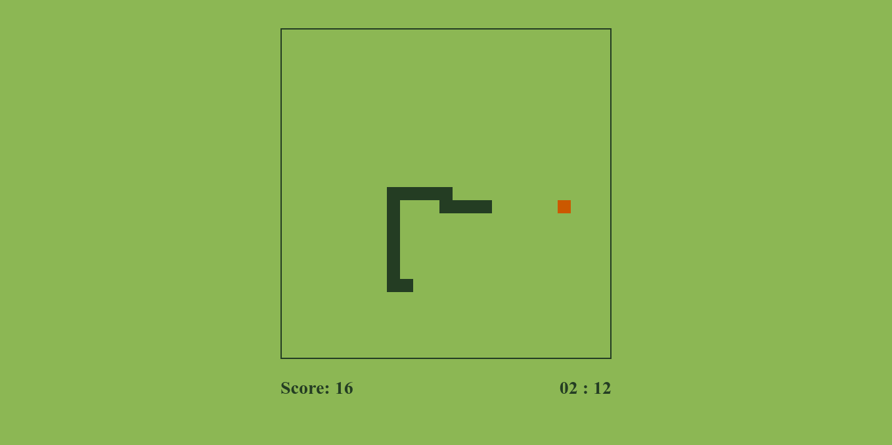
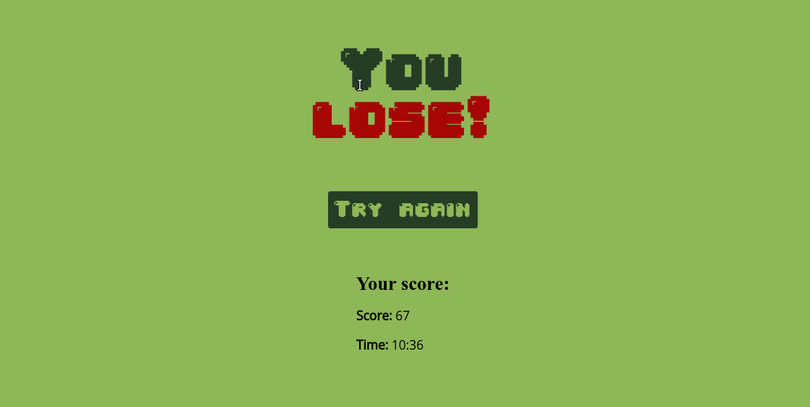

    <h1>Snake Game🐍</h1>
    
A Snake Game made with Typescript and Vite without using canvas.

    
    

#### TODO: ####

- It has a bug when the movement keys are pressed quickly.
- I want to add a local scoreboard.
- some day...
